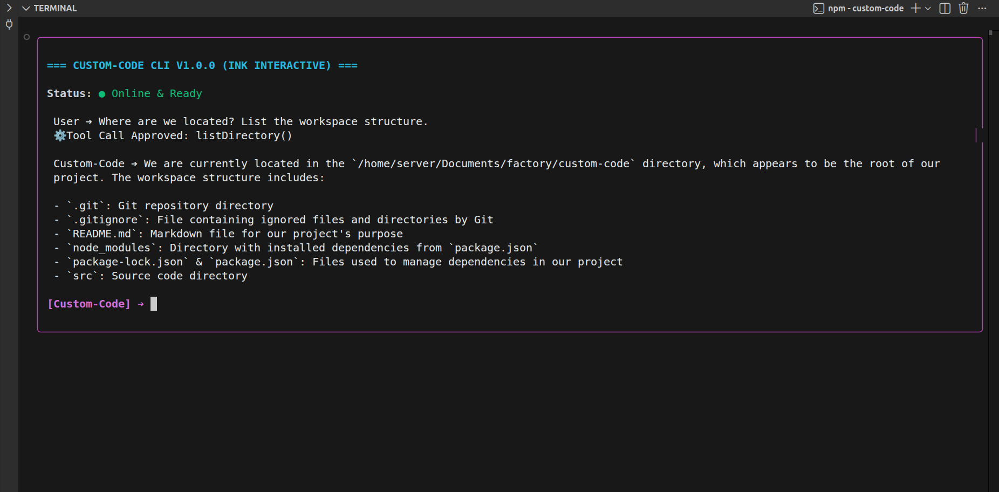
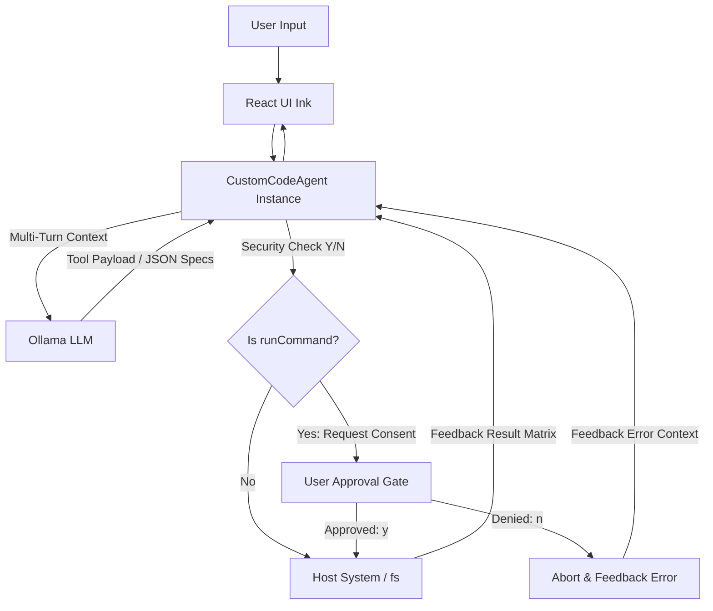

# 🔮 Custom-Code CLI (v1.0.0)



Custom-Code is an elite, autonomous, open-source DevOps and Backend automation AI agent that operates locally inside your terminal. Built using **TypeScript**, **Node.js**, **React (Ink)**, and the **OpenAI SDK**, it leverages local LLMs via **Ollama** to achieve true autonomous task-solving capabilities.

Unlike standard stateless chatbots, Custom-Code implements a mature **ReAct (Reasoning + Action) architecture**, enabling it to think, plan, and execute system commands natively on your host environment to solve real development friction.

---

## 🚀 Core Features

- **Autonomous Tool Calling:** The agent independently decides when to read files, write code, or execute system checks.
- **Interactive React Terminal UI:** Powered by `Ink`, stripping raw ANSI escape codes for a modern, reactive component-driven layout.
- **Human-in-the-Loop Security:** Structural confirmation layer (Y/N prompt) that freezes execution when a shell execution is requested.
- **Local & Private Native Performance:** Orchestrated locally via Ollama (`llama3.2:3b`), ensuring zero API costs and total code privacy.

---

## 🛠️ The Tech Stack

- **Frontend/UI:** React 18+ inside the terminal via `Ink` & `ink-text-input`.
- **Runtime:** Node.js + TypeScript execution layer via `tsx`.
- **LLM Gateway:** OpenAI Node SDK connected to a local `Ollama` engine.
- **Host Automation:** Native Node.js `fs` (File System) and `child_process` (Shell Core Executor).

---

## 📋 Architecture & Data Flow



---

## ⚡ Getting Started

### 1. Prerequisites
Ensure you have Node.js (v18+) and Ollama running locally with a tool-calling capable model:
```bash
ollama run llama3.2:3b
```

### 2. Installation
Clone the repository and install system dependencies:
```bash
git clone https://github.com/Mateus-Sebastiao/custom-code-cli.git
cd custom-code-cli
npm install
```

### 3. Environment Setup
Create a `.env` file in the root directory:
```env
OPENAI_BASE_URL=http://localhost:11434/v1
OPENAI_API_KEY=ollama
AI_MODEL=llama3.2:3b
```

### 4. Run the Agent
Launch the interactive React CLI console loop:
```bash
npx tsx src/index.tsx
```

---

## 📜 License
Distributed under the ISC License. See `LICENSE` for more information.

Developed with 🧠 by **Mateus**.